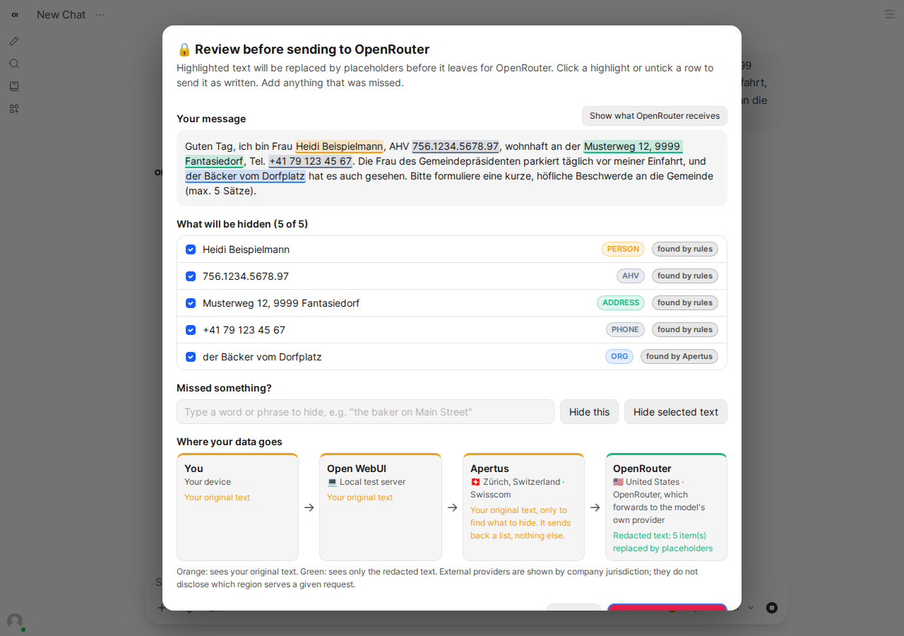
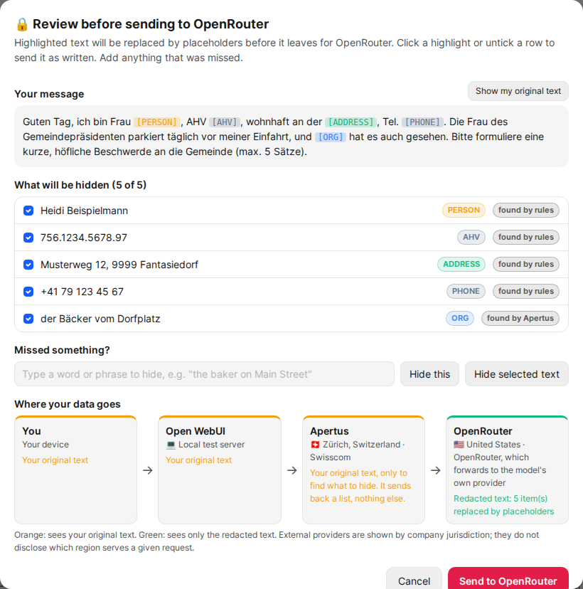
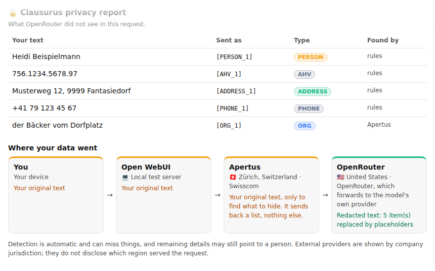

# Clausurus 🔒

An Open WebUI **Pipe** function for sending a message to an external,
bring-your-own-key LLM (OpenAI, Gemini, Anthropic or OpenRouter) with personal
details hidden first. It adds four entries to the model menu, *Clausurus 🔒 ·
OpenAI*, *· Gemini*, *· Anthropic* and *· OpenRouter*, next to the Apertus models
users already have.

Built for the Swiss {ai} Weeks "Public AI" challenge.



## What it does

1. **Finds personal data** in every message of the conversation (the whole history
   is sent to the provider on each turn, so it is all redacted each time), in two
   layers:
   - **Rules**: AHV/AVS numbers, IBANs, Swiss UID/CHE numbers and payment cards
     (all checksum-validated), emails, Swiss phone numbers, IP addresses, vehicle
     plates, DE/FR/IT/EN street addresses and postcodes, and names after a title
     ("Frau", "M.", "Sig.ra", "Mr").
   - **Apertus**: finds names, organisations, places and *contextual* identifiers
     that rules can't, such as "the only pharmacist in the village" or "the mayor's
     wife". Apertus is only asked *what to hide*; it never answers the question.
2. **Lets you review it** (on by default, per user). Before anything is sent, a
   dialog shows your message with every finding highlighted, what found it (rules,
   Apertus or you), and where the data goes. You can:
   - click a highlight or untick a row to send it as written (false positive);
   - type a phrase, or select text and press *Hide selected text*, to hide
     something that was missed;
   - switch the preview to *what the provider receives*;
   - cancel. Nothing is sent unless you press *Send*.

   Your choices are remembered for the rest of the chat and shown again (and can be
   reversed) the next time.
3. **Replaces** each hidden value with a placeholder (`[PERSON_1]`, `[AHV_1]`,
   `[CONTEXT_1: a specific local individual]`, ...), consistently across the
   conversation, and tells the model to keep placeholders as they are.
4. **Sends** the redacted conversation with the user's own API key.
5. **Restores** the real values in the reply as it streams in.
6. **Adds a privacy report** under the reply (optional, per user): each hidden
   value, the placeholder the provider saw, what found it, what you chose to send
   as written, and where the data went.





### Where your data goes

Both the dialog and the report show the path a message takes and what each hop
sees:

| Hop | Where | Sees |
|---|---|---|
| You | Your device | Original text |
| Open WebUI | Set by the admin (`server_location`); chat.publicai.co runs in AWS eu-central-2, Zürich | Original text |
| Apertus | Set by the admin (`apertus_location`); default endpoint verified in Zürich, Switzerland (Swisscom, AS3303) | Original text, to find what to hide; returns a list only |
| External provider | Company jurisdiction: 🇺🇸 United States for all four | Redacted text only |

The external providers are shown by **company jurisdiction**, not server location:
their API hostnames resolve to anycast networks (Cloudflare, Google, Anthropic) and
they don't disclose which region serves a given request. Locations are labels an
admin sets, not live measurements; update them if you change the endpoints.

## Threat model: read this before relying on it

**What Clausurus does**: stops the chosen external provider from seeing the
personal details it finds (or that you mark), and shows you exactly what those are.

**What Clausurus does not do**:

- **It does not guarantee anonymity.** Detection misses things (see the eval
  below), and the details left in the text can still point to a person: a rare
  job, a small village, a specific date.
- **Pseudonymised text can still be personal data.** Under the Swiss FADP and the
  GDPR, text with identifiers replaced by placeholders is not automatically
  anonymous, especially while the mapping back to real values exists (it does,
  here, for the duration of the request) or when the person is identifiable from
  context.
- **It is not a compliance certification.** Nobody has audited it against the FADP,
  the GDPR or any standard. It is a best-effort technical control.
- **Apertus sees the original text.** To find what to hide, the full message goes
  to the configured Apertus endpoint (by default the Swiss AI Weeks endpoint
  hosted by Swisscom in Zürich). Point `apertus_api_base` at an Apertus deployment
  you trust, for example the platform's own.
- **The Open WebUI server sees the original text**, as it does for every chat.
- **Text only.** Images and files can't be redacted, so they are not sent to the
  provider unless an admin enables `allow_images`.
- **Apertus output is not trusted blindly.** Only spans that appear word for word
  in your message are used, so a confused or manipulated Apertus answer can't
  inject text. It can still *miss* things; the rules layer and the review dialog
  are the backstop.
- **If Apertus fails**, the request is blocked by default rather than sent with
  less redaction (configurable).

## Settings

### Admin valves

| Valve | Default | Purpose |
|---|---|---|
| `apertus_api_base` | Swiss AI Weeks endpoint | OpenAI-compatible Apertus endpoint, used only for detection |
| `apertus_api_key` | *(empty)* | Key for that endpoint |
| `apertus_model` | `swiss-ai/Apertus-v1.5-70B` | Model name at that endpoint |
| `apertus_location` | `🇨🇭 Zürich, Switzerland · Swisscom` | Shown in the data-flow view |
| `server_location` | *(generic label)* | Where this Open WebUI runs, shown in the data-flow view |
| `enable_apertus` | `true` | Off = rules and checksums only |
| `block_on_apertus_failure` | `true` | Block the request if Apertus fails, instead of rules-only with a warning |
| `allow_images` | `false` | Send image/file parts unredacted |
| `review_timeout_seconds` | `300` | Close the review dialog (and cancel) after this |
| `*_api_key` | *(empty)* | Admin fallback keys, for demos only; every user would spend them |
| `*_model` | `gpt-4.1-mini`, `gemini-2.5-flash`, `claude-sonnet-5`, `openai/gpt-4.1-mini` | Model per provider |

### User settings (Settings → Functions → Clausurus)

| Setting | Default | Purpose |
|---|---|---|
| `review_before_sending` | on | Show the review dialog before each message |
| `show_privacy_report` | on | Add the privacy report under each reply |
| `openai_api_key`, `gemini_api_key`, `anthropic_api_key`, `openrouter_api_key` | *(empty)* | Your own keys. A user key always wins over an admin fallback key |

## Limits

- **Detection misses contextual phrases.** In the eval, all remaining leaks are
  descriptions like "my neighbour on the third floor". In live testing, "Die Frau
  des Gemeindepräsidenten" in the demo letter was flagged only partly
  ("Gemeindepräsidenten") or not at all, depending on the run. Keep the review
  step on when it matters.
- **Review decisions live in server memory**, per user and chat. After a restart,
  a function update, or on another replica, they are forgotten: things you chose to
  send as written get hidden again (safe), but **phrases you added are no longer
  hidden automatically** until you add them again. With the review step on you see
  this in the dialog; with it off you don't.
- **The review dialog is JavaScript that runs in the Open WebUI page** (Open WebUI's
  `execute` event). That is how Open WebUI lets functions show custom UI, and it
  means admins should only install this function from a source they trust. The
  dialog inserts all message text as plain text, never as HTML.
- **Title, tag and follow-up generation** go through Clausurus too when it is the
  selected model. They are redacted the same way, silently (no dialog or report).
- **Formats**: the rules are tuned for Swiss and DE/FR/IT/EN formats; other
  countries' ID and phone formats mostly rely on Apertus.
- **Restoring** is plain text replacement. If the model rephrases a placeholder
  (`[Person 1]`), that value stays a placeholder in the reply.

## Eval results

40 synthetic Swiss texts (DE/FR/IT/EN; complaint letters, commune correspondence,
HR emails, bank-style letters) with 172 annotated identifiers, generated by
`eval/gen_dataset.py` (seeded, reproducible). Full table: [`eval/results.md`](eval/results.md).

| | Rules only | Rules + Apertus |
|---|---|---|
| **Identifiers leaked** (no redaction overlapping them) | **63 / 172 (37%)** | **4 / 172 (2.3%)** |
| AHV, IBAN, email, phone, address recall | 1.00 | 1.00 |
| Personal names recall | 0.19 | 1.00 (precision 0.76) |
| Contextual identifiers recall | 0.00 | 0.75 (precision 0.58) |

- All 4 remaining leaks are contextual phrases ("mein Nachbar im dritten Stock",
  "mon voisin du troisième étage", "le nouveau concierge de l'immeuble 4", "my
  neighbour on the third floor").
- Apertus also flags place names that aren't in the gold set (33 LOCATION spans):
  over-redaction, not a leak, but it makes the text sent less readable.
- An earlier version reported 1 / 172. That run was flawed: the Apertus prompt used
  two example phrases that also appear in the eval set. The prompt examples now
  share no phrase with the eval set, and 4 / 172 is the clean number.
- This is Clausurus' own eval on its own templated synthetic data, written by the
  same people as the detector. It is a development signal, not an independent
  audit; expect more misses on real correspondence.

## Try it

**Tests** (mocked, no network or keys):

```bash
pytest community/owui_functions/clausurus/tests -v
```

**See the redaction without Open WebUI:**

```bash
cd community/owui_functions/clausurus/demo
python show_redaction.py letter_de.txt --no-apertus        # rules only
APERTUS_API_KEY=... python show_redaction.py letter_de.txt  # rules + Apertus
```

**Full UI with Docker:**

```bash
cd community/owui_functions/clausurus/demo
cp .env.example .env   # fill in WEBUI_SECRET_KEY, APERTUS_API_KEY and one provider key
docker compose up
# open http://localhost:3000, log in as admin@example.com / clausurus-demo-only,
# pick "Clausurus 🔒 · <provider>" in the model menu
```

**Full UI without Docker** (what was used to test this function):

```bash
pip install open-webui==0.11.3
WEBUI_SECRET_KEY=change-me open-webui serve --port 8080 &
cd community/owui_functions/clausurus/demo
WEBUI_BASE_URL=http://localhost:8080 APERTUS_API_KEY=... OPENROUTER_API_KEY=... \
  python install_function.py
```

**On an existing Open WebUI**: Admin Panel → Functions → + → paste `clausurus.py`,
enable it, then set the Apertus key and locations in its valves. Each user adds
their own provider key in Settings → Functions → Clausurus.

**Eval:**

```bash
python eval/gen_dataset.py                    # regenerate the dataset
python eval/run_eval.py --rules-only          # no key needed
APERTUS_API_KEY=... python eval/run_eval.py   # rules + Apertus (~4 min, rate-limited)
```

## License

MIT, like the rest of this repository.
